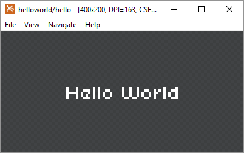
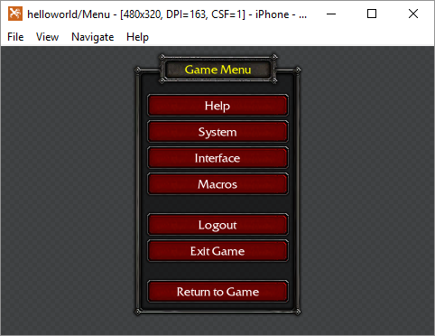

# Talon
Talon is UI toolkit for responsive interface building.

Features:

- Use *XML syntax* for declarative markup interface
- Apply *CSS dialect* for easy skinning and styling
- Build interface with *responsive layouts*
- Localize using *properties* files
- View interface outside your app with *talon browser*

Checkout detailed [documentation](./docs/index.md).

## Getting Started!

1. Download and install Talon Browser from [last release](https://github.com/Maligan/Talon/releases/latest)
2. Create new folder `helloworld`
3. Create new file `hello.xml` in `helloworld` folder:

	```xml
	<def ref="hello">
		<txt text="Hello World" fontSize="32px" fontColor="white" />
	</def>
	```

4. Open folder in browser (via `File -> Open`)
5. Open template in browser (`Navigate -> Go To Template` or <kbd>Ctrl</kbd> + <kbd>P</kbd>) and you will see:  

	

	Awesome! You did it!

## How browser works?

> Talon Browser follow [interactive programming](https://en.wikipedia.org/wiki/Interactive_programming) approach — it start watch any file within opened folder (recursively).  
And after any changes browser try to reload file and refresh result.

Let's plunge into memories and create more complex example. For this add next files into `helloworld` folder:

1. Template `menu.xml`

	```xml
	<def ref="Menu">
		<div class="Menu" header="Game Menu">
			<txt id="header" text="@header" />
			<div id="buttons" layout="flow" orientation="vertical" top="16px">
				<txt text="Help" />
				<txt text="System" />
				<txt text="Interface" />
				<txt text="Macros" marginBottom="16px" />
				<txt text="Logout" />
				<txt text="Exit Game" marginBottom="16px"/>
				<txt text="Return to Game" />
			</div>
		</div>
	</def>
	```
2. Stylesheet `menu.css`

	```css
	.Menu {
		/* Background */
		fill: $dialog-border;
		fillStretchGrid: 16px;
		/* Font */
		fontName: FrizQuadrata;
		fontSize: 13px;
		fontColor: white;
		/* Layout */
		padding: 16px;
	}

	.Menu #header {
		/* Background */
		fill: $dialog-header;
		fillStretchGrid: 16px;
		/* Font */
		fontColor: yellow;
		align: center;
		/* Layout */
		padding: 16px 16px 12px;
		minWidth: 139px;
		top: -30px;
	}

	.Menu #buttons txt { 
		/* Background */
		fill: $button-up;
		fillStretchGrid: 8px;
		/* Text */
		text: Button;
		align: center;
		/* Layout */
		padding: 10px 8px 6px;
		width: 160px; /* 127px; */
		/* Mouse */
		touchMode: leaf;
		touchEvents: true;
		cursor: button;
	}

	.Menu #buttons txt:hover {
		filter: brightness(0.05);
	}

	.Menu #buttons txt:active {
		fill: $button-down;
	}
	```

	Do not try to understand all of properties just now (they are not same as in W3C CSS) they are explained in [other articles](#whats-next).

3. And this carefully picked up coin image `coin.png`

	

Each of files will be loaded and processed according to theirs content. From `menu.xml` will be created new template — *Menu*, styles from `menu.css` will be merged to global style scope and `coin.png` will be loaded as picture:



Do you have a flashback? I do.

## Templating
Advantages of [wise templating](https://en.wikipedia.org/wiki/Code_reuse#Criticism) are simplicity in apps, speed up development and in my opinion main one - saving developers nerves.

Template — reusable tree of elements. It can be *applied* at any **leaf** node of another template.


There are two sintax way to apply template in TML — via ref and via tag, go look at this methods. Make same changes in `button.xml`:

```xml
<def ref="Button" tag="button">
	<node class="button" label="Label">
		<label text="@label" />
		<image source="@icon" />
		<label text="@count" />
	</node>
</def>
```

Beside new `def` attribute `tag` you can notice attriubtes *binding* (via *@-notation*). If you are not familiar with [data binding](https://en.wikipedia.org/wiki/Data_binding) technique it's not a problem — *@-notation* just bind attribute to *template root* attribute. Binded attributes changes together.

Lets create one more template `popup.xml`:

```xml
<def ref="Popup">
	<node class="popup">
		<label text="You sure want to buy Vorpal Blade?" />
		<!-- Insert template via ref -->
		<use ref="Button" update="label: Cancel" />
		<!-- Insert template via tag -->
		<button label="Buy" icon="$coin" count="30" />
	</node>
</def>
```

And add same styles for beauty `popup.css`:

```css
.popup {
	fill: gray;
}
```

This is result:


## Import layouts into apps

If you use talon not only for mockups, once you need import you layouts into app. There are **really many ways** to do it, let show easiest:

1. Pack to zip-archive folder via `File -> Publish` (or <kbd>Ctrl</kbd> + <kbd>Shift</kbd> + <kbd>S</kbd>)
2. Place zip-archive into source path folder, add it to compile with `[Embed]` meta tag.
3. Load embedded data to `starling.extensions.TalonFactory`, and use it to instantiate template.

For example go change [Starling's First Steps: Create your Game](http://gamua.com/starling/first-steps/) application and expand it with talon facotry:

```actionscript
import starling.display.Sprite;
import starling.extensions.TalonFactory;

public class Game extends Sprite
{
	[Embed(source="helloworld.zip")]
	private static const helloworld_zip:Class;

	public function Game()
	{
		var talon:TalonFactory = new TalonFactory();

		talon.importArchiveAsync(new helloworld_zip(), function():void
		{
			addChild(talon.build("BankPopup") as Sprite);
		}
	}
}
```

Build and run the app, if you are lucky then you can see:


GG, Easy.

## What's next?
After this introduction article I recommend you checkout detailed [**documentation**](./index.md). For quick explore talon's features you can read next part of documentation first:
* [Background](./background.md) — main way to display pictures
* [Layouts](./layouts.md) — how to position elements respect each other and free parent space
* [CSS Dialect](./css.md) — list of **all** attributes implemented within talon
