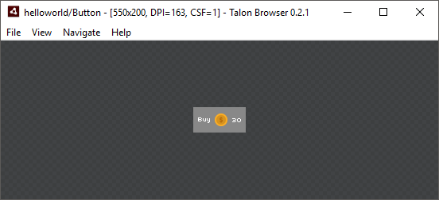
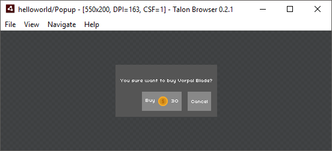

## Getting Started!

1. Download and install [Talon Browser]() from last release
2. Create new folder `helloworld`
3. Create new file `hello.xml` in `helloworld` folder:

	```xml
	<def ref="Hello">
		<label text="Hello World" />
	</def>
	```

4. Open folder with browser (via `File -> Open`)
5. Open file with browser (`Navigate -> Go To Template` or <kbd>Ctrl</kbd> + <kbd>P</kbd>) and you will see:  

	

	Awesome! You did it!

## How browser works?

> Talon Browser follow [interactive programming](https://en.wikipedia.org/wiki/Interactive_programming) approach — it start watch any file within opened folder (recursively).  
And after any changes browser try to reload file and refresh result.

Lets create more complex example. For this add next three files into `helloworld` folder:

1. Template `button.xml`

	```xml
	<def ref="Button">
		<node class="button">
			<label text="Buy" />
			<image source="$coin" />
			<label text="3" />
		</node>
	</def>
	```
2. Stylesheet `button.css`

	```css
	.button {
		/* background */
		fill: #888888;
		/* font */
		fontName: Arial;
		fontSize: 14px;
		/* layout */
		padding: 8px;
		gap: 4px;
		/* mouse */
		cursor: button;
		touchMode: leaf;
		touchEvents: true;
	}

	.button:hover {
		fill: #8f8f8f;
	}

	.button:active {
		fill: #808080;
	}
	```

	Do not try to understand all of properties just now, they are explained in [other articles](#whats-next).

3. And this carefully picked up coin image `coin.png`

	

Each of files will be loaded and processed according to theirs content. From `button.xml` will be created new template — *Button*, styles from `style.css` will be merged to global style scope and `coin.png` will be loaded as picture.

Look at result:



## Templating
Advantages of [wise templating](https://en.wikipedia.org/wiki/Code_reuse#Criticism) are simplicity in apps, speed up development and in my opinion main one - saving developers nerves.

Template — reusable tree of elements. It can be *applied* at any **leaf** node of another template.


There are two sintax way to apply template in TML — *full* and *simple*, here we look at *simple* method.  
To do this, you need link template with tag name, see updated version of `button.xml`:

```xml
<def ref="Button" tag="button">
	<node class="button" label="Label">
		<label text="@label" />
		<image source="@icon" />
		<label text="@count" />
	</node>
</def>
```

Beside new `def` attribute `tag` you can notice attriubtes *binding* (via *@-notation*). If you are not familiar with [data binding](https://en.wikipedia.org/wiki/Data_binding) technique it's not a problem — *@-notation* just bind attribute to *template root* attribute. Binded attributes changes together.

Lets create one more template `popup.xml`:

```xml
<def ref="Popup">
	<node class="popup">
		<label text="You sure want to buy Vorpal Blade?" />
		<button label="Buy" icon="$coin" count="30" />
		<button label="Cancel" />
	</node>
</def>
```

И чтобы всё приняло божеский вид нужно добавить стили `popup.css`:

```css
.popup {
	fill: gray;
}
```

И вот как это должно выглядить:



## Import layouts into apps

Если вы не ставите себе цель только создания мокапов, то вам когда-нибудь понадобится перенести ваши наработки в игру. Есть много путей сделать это, но давайте рассмотрим самый быстрый:

1. Упакуйте папку вашего проекта в zip архив выполнив `File -> Publish` или нажав <kbd>Ctrl</kbd> + <kbd>Shift</kbd> + <kbd>S</kbd>
2. Поместите архив в директорию с ассетами вашей игры и включите файл в сборку через мета-тег `[Embed]`
3. Для примера возьмём тривиальное Starling приложение из раздела [First Steps: Create your Game](http://gamua.com/starling/first-steps/) и дополним его необходимым кодом

```actionscript
import starling.display.Sprite;

import talon.utils.TalonFactory;

public class Game extends Sprite
{
	[Embed(source="helloworld.zip")]
	private static const helloworld_zip:Class;

    public function Game()
    {
		var factory:TalonFactory = new TalonFactory();

		// factory has deep integration with starling's AssetManager
		factory.assets.enqueue(new helloworld_zip());
		factory.assets.loadQueue(function(progress:Number):void
		{
			if (progress == 1)
			{
				var popup:ITalonElement = _factory.createElement("Popup");

				addChild(popup as Sprite);
			}
		});
    }
}
```

Собрите и запустите приложение, при должной сноровке у вас должно получится:


Easy.

## What's next?
After this introduction article I recommend you checkout detailed [documentation](./index.md). For quick explore talon's features you can read next part of documentation first:
* [Background](./background.md) — main way to display pictures
* [Layouts](./layouts.md) — how to position elements respect each other and free parent space
* [CSS Dialect](./css.md) — list of **all** attributes implemented within talon
